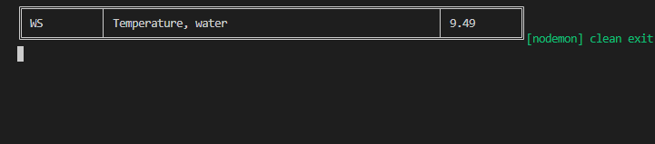
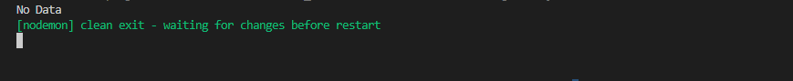

# Specifications

Write a program in JavaScript that takes as input the csv file downloaded from data stream at https://doi.org/10.25976/vahx-dq27 and a “MonitoringLocationID” and outputs the average "ResultValue" for “CharacteristicName" === "Temperature, water” for the location provided.

# How to run the code locally

install

```
yarn
```

run it

```
yarn dev <filename>.csv --location="WS" --field="Temperature, water"
```

# Final output

## Data exists

```
yarn dev ecosystem.csv --location="WS" --field="Temperature, water"
```



## Data dosn't exist

```
yarn dev ecosystem.csv --location="WS" --field="foobar"
```


